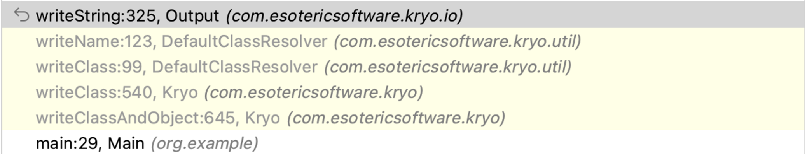
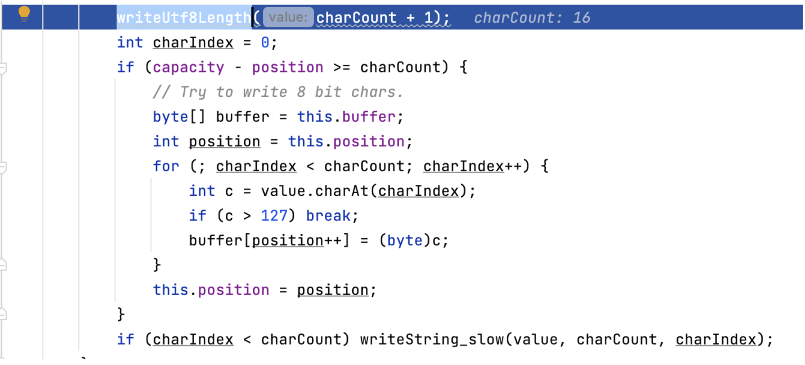
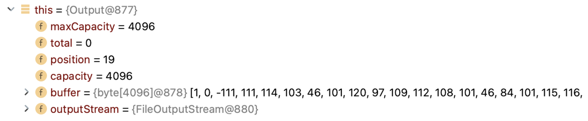
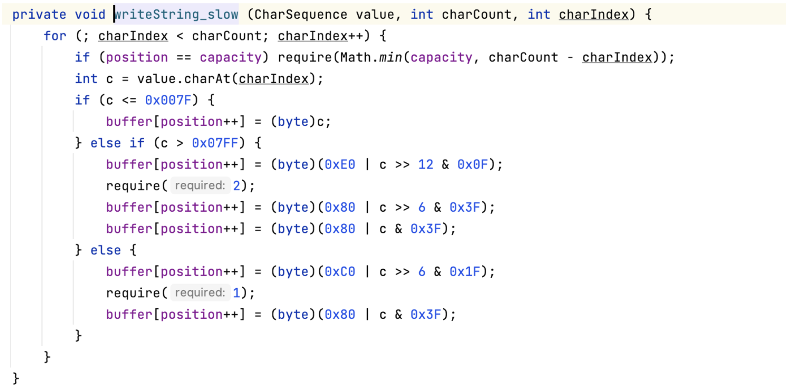
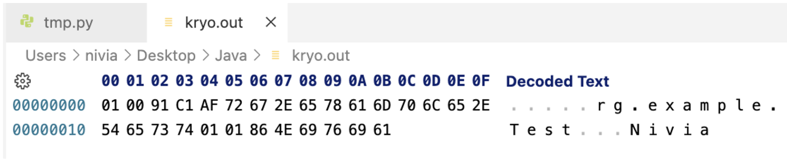
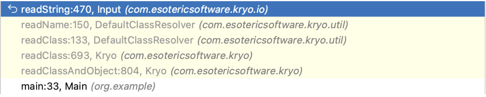
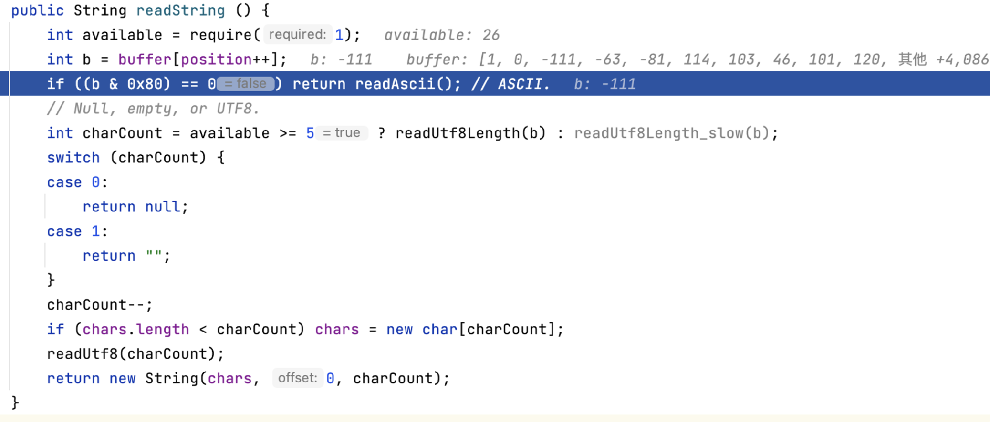
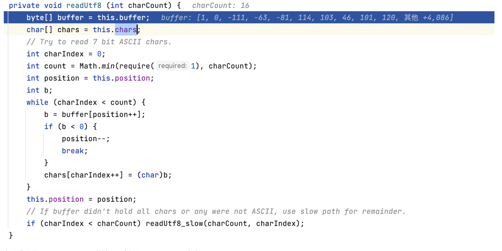

# Kryo-UTF8-Overlong-Encoding

### 前言

学了1ue和phith0n师傅介绍的知识点，让我受益匪浅。Java的原生反序列化是从IO流中读出对象的过程，除了Java原生的反序列化以外，kryo的反序列化也是从IO流中去读取对象，那么kryo会不会也存在相关的混淆方案呢

kryo提供了三种方法来反序列化，分别是：readObject、readObjectOrNull、readClassAndObject，其中readObject跟readObjectOrNull都需要绑定一个Class对象作为反序列化还原的对象，而readClassAndObject则是从IO流中获取对象，那么这里主要跟进readClassAndObject进行分析

```
Kryo kryo = new Kryo();
Input input = new Input(new FileInputStream("kryo.out"));
Test test = (Test)kryo.readClassAndObject(input);
input.close();
```

一个demo

```
package org.example;

import java.io.Serializable;

public class Test implements Serializable {
    public String name = "Nivia";
    transient String id = "abc";

    public String getName() {
        return name;
    }
}
```

### UTF-8模式下的IO流写入流程

数据写入时，获取类名的调用栈



writeString方法

```
public void writeString (String value) throws KryoException {
		if (value == null) {
			writeByte(0x80); // 0 means null, bit 8 means UTF8.
			return;
		}
		int charCount = value.length();
		if (charCount == 0) {
			writeByte(1 | 0x80); // 1 means empty string, bit 8 means UTF8.
			return;
		}
		// Detect ASCII.
		boolean ascii = false;
		if (charCount > 1 && charCount < 64) {
			ascii = true;
			for (int i = 0; i < charCount; i++) {
				int c = value.charAt(i);
				if (c > 127) {
					ascii = false;
					break;
				}
			}
		}
		if (ascii) {
			if (capacity - position < charCount)
				writeAscii_slow(value, charCount);
			else {
				value.getBytes(0, charCount, buffer, position);
				position += charCount;
			}
			buffer[position - 1] |= 0x80;
		} else {
			writeUtf8Length(charCount + 1);
			int charIndex = 0;
			if (capacity - position >= charCount) {
				// Try to write 8 bit chars.
				byte[] buffer = this.buffer;
				int position = this.position;
				for (; charIndex < charCount; charIndex++) {
					int c = value.charAt(charIndex);
					if (c > 127) break;
					buffer[position++] = (byte)c;
				}
				this.position = position;
			}
			if (charIndex < charCount) writeString_slow(value, charCount, charIndex);
		}
	}
```

形参value为类名，只要类名中全是ascii字符就走ascii字符处理，否则尝试走UTF-8处理模式

这里有个坑点，就是纯ASCII和UTF-8模式的数据写入是存在差异的，不是直接修改就能成功，为了了解UTF-8处理模式，我这里重写了源码，让if语句中的ascii布尔值进行了取反



先是调用writeUtf8Length方法，方法将指定的UTF-8长度写入到IO流

然后遍历类名，当发现不是ascii字符会break



如果出现break情况，就会调用writeString_slow方法



方法就是unicode码转换成UTF-8编码的原理

### UTF-8模式下的IO流读取

按照Overlong Encoding的原理，对IO流数据进行替换



然后调试一下反序列化的过程，相关调用栈



在Input#readString方法中



如果是正常的ascii序列化，buffer记录完classid后就直接存储类名了，而UTF-8会先记录UTF-8的长度。而在反序列化阶段，kryo用这个差异判断进行哪种模式的反序列化

readUtf8Length方法读取出长度，主要处理逻辑在readUtf8方法



如果发现是Overlong Encoding的情况，会调用readUtf8_slow方法

```
private void readUtf8_slow (int charCount, int charIndex) {
		char[] chars = this.chars;
		byte[] buffer = this.buffer;
		while (charIndex < charCount) {
			if (position == limit) require(1);
			int b = buffer[position++] & 0xFF;
			switch (b >> 4) {
			case 0:
			case 1:
			case 2:
			case 3:
			case 4:
			case 5:
			case 6:
			case 7:
				chars[charIndex] = (char)b;
				break;
			case 12:
			case 13:
				if (position == limit) require(1);
				chars[charIndex] = (char)((b & 0x1F) << 6 | buffer[position++] & 0x3F);
				break;
			case 14:
				require(2);
				chars[charIndex] = (char)((b & 0x0F) << 12 | (buffer[position++] & 0x3F) << 6 | buffer[position++] & 0x3F);
				break;
			}
			charIndex++;
		}
	}
```

跟UTF8-Overlong-Encoding的原理就一样啦

### 混淆属性

除了类名我们还能混淆什么？

相关存在混淆的方法都位于Input的类下，除了readString方法以外还有readStringBuilder，跟其对应的就是相关的Output#write方法，只要经过相关write方法处理并加进了序列化IO流，就应该可以实现IO流混淆

获取完类名以后，会通过对象类型获取序列化器，在一系列的Serializer#read方法还原对象后去还原属性，可以简单去序列化器里面进行一些搜索，这里只收集了部分有价值的

混淆字符串类型的变量，相关调用栈


混淆Class类型的变量


在DefaultSerializers中，更多的还有StringBuffer和StringBuilder、Charset、URL

其他序列化器：

- DefaultArraySerializer

  存放允许混淆的类型时

  

- MapSerializer

  key、value是允许混淆的类型时

  

等等

### 混淆实现

其实这里很简单，重写Output源码，让数据写入IO流的操作全走writeString_slow方法


分别对应着1、3、2字节的写入方法，然后注释掉1、3字节写入的部分就能实现数据混淆

混淆前后对比


### 更近一步

同样kryo支持Java原生反序列化，Java原生反序列化也同样存在Overlong Encoding的混淆方法，具体实现可以重写JavaSerializer序列化器write方法下的源码，替换掉ObjectOutputStream对象即可

### 数据流转换

```
FileOutputStream barr = new FileOutputStream("kryo.out");
Output output = new Output(barr);
kryo.writeClassAndObject(output, test);
output.close();
```

用户自行生成的序列化数据，是以ascii模式生成，能否实现从ascii流转换成UTF-8形式的流

UTF-8形式


ASCII形式


原理也很简单，还原最后一位字符，把Utf8Length写到前头就OK了

最后一位的操作


逆向操作


### 结语

如果存在错误或者建议还请师傅们提issue交流指导🙏

### 参考

https://t.zsxq.com/17t04ii1S

https://www.leavesongs.com/PENETRATION/utf-8-overlong-encoding.html
